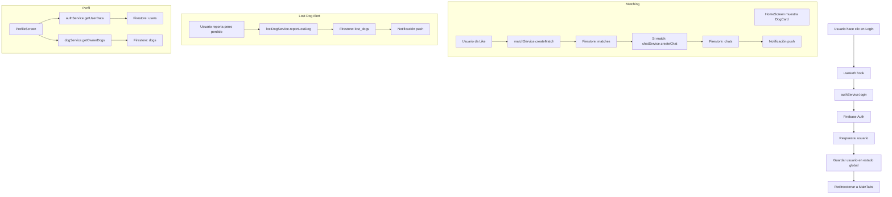

# PetPlay - MVP Mobile App

Conecta dueños de perros para que sus mascotas jueguen juntas.

## Stack Tecnológico

- **Frontend**: React Native + Expo
- **TypeScript**: Tipado completo
- **Backend**: Firebase (Auth + Firestore)
- **Navegación**: React Navigation
- **Estilos**: StyleSheet

## Estructura del Proyecto

```
petplay/
├── src/
│   ├── components/       # Componentes reutilizables
│   ├── screens/          # Pantallas de la app
│   ├── navigation/       # Stack y Tab navigation
│   ├── services/         # Firebase y API calls
│   ├── hooks/            # Custom hooks
│   ├── types/            # TypeScript types
│   ├── utils/            # Utilidades
│   └── assets/           # Imágenes, iconos
├── App.tsx               # Punto de entrada
├── app.json              # Config Expo
└── package.json          # Dependencias
```

## Configuración Rápida

### 1. Instalar dependencias

```bash
npm install
```

### 2. Configurar Firebase

Reemplaza las credenciales en `src/services/firebase.ts` con tus valores reales de Firebase.

```typescript
const firebaseConfig = {
  apiKey: "TU_API_KEY",
  authDomain: "TU_AUTH_DOMAIN",
  projectId: "TU_PROJECT_ID",
  storageBucket: "TU_STORAGE_BUCKET",
  messagingSenderId: "TU_MESSAGING_SENDER_ID",
  appId: "TU_APP_ID"
};
```

### 3. Ejecutar la app

```bash
npx expo start
```

Luego presiona:
- **`a`** para abrir en Android emulator
- **`i`** para abrir en iOS simulator
- **`w`** para abrir web (limitado)

## Funcionalidades del MVP

### ✅ Autenticación
- Registro con email/password
- Login
- Logout
- Manejo de sesión con Firebase Auth

### ✅ Perfil de Usuario
- Datos básicos (nombre, zona)
- Guardado en Firestore

### ✅ Perfil de Perrito
- Nombre, raza, edad, género, tamaño
- Nivel de energía y personalidad
- Crear, editar, eliminar perros

### ✅ Matching (Core)
- Descubrir perros cercanos (por zona)
- Cards deslizables
- Enviar invitaciones de juego
- Guardar matches en Firestore

### ✅ Comunidad
- Feed de mascotas nuevas
- Alertas de perros perdidos
- Sistema de reporte y resolución

### ✅ Notificaciones
- Estructura preparada (push real en v2)

## Navegación

**Auth Flow:**
- Onboarding → Login / Register

**Main App (Tabs):**
- **Descubre**: Matching de perros
- **Comunidad**: Alertas y feed
- **Perfil**: Mi información y mis perros

## Pantallas Principales

| Pantalla | Descripción |
|----------|-------------|
| OnboardingScreen | Presentación inicial |
| LoginScreen | Iniciar sesión |
| RegisterScreen | Crear cuenta |
| HomeScreen | Matching principal |
| CommunityScreen | Alertas de perros perdidos |
| ProfileScreen | Perfil usuario y sus perros |
| DogProfileScreen | Crear/editar perro |
| SettingsScreen | Configuración |

## Datos en Firestore

### Collections

**users**
```
{
  id: string
  email: string
  name: string
  zone: string
  createdAt: number
  photoUrl?: string
}
```

**dogs**
```
{
  id: string
  ownerId: string
  name: string
  breed: string
  photo: string
  ageCategory: "cachorro" | "adulto" | "senior"
  gender: "macho" | "hembra"
  size: "pequeño" | "mediano" | "grande"
  energyLevel: "bajo" | "medio" | "alto"
  personality: string[]
  compatibility: string[]
  zone: string
  createdAt: number
  isLost?: boolean
  lostDate?: number
  lostDescription?: string
}
```

**matches**
```
{
  id: string
  userId1: string
  userId2: string
  dogId1: string
  dogId2: string
  status: "pending" | "accepted" | "rejected"
  createdAt: number
  respondedAt?: number
}
```

**lost_dogs**
```
{
  id: string
  ownerId: string
  dogId: string
  dogName: string
  description: string
  location: string
  date: number
  resolved: boolean
  photo: string
}
```

## Componentes Reutilizables

- **Button**: Primario, secundario, peligro
- **Input**: Con validación y manejo de errores
- **DogCard**: Card de perro con acciones
- **LostDogCard**: Card para alertas perdidas
- **ScreenContainer**: Layout base con padding

## Hooks Personalizados

- **useAuth**: Login, register, logout, obtener usuario
- **useDogs**: Obtener perros por zona o propietario

## Próximas Mejoras (v2)

- [ ] Push notifications reales
- [ ] Chat entre usuarios
- [ ] Galería de fotos para perros
- [ ] Google Maps integrado
- [ ] Sistema de ratings
- [ ] Historial de encuentros
- [ ] Filtros avanzados de matching
- [ ] Integración de pagos

## Desarrollo

### Scripts útiles

```bash
# Iniciar dev
npm start

# Ejecutar tests (cuando estén listos)
npm test

# Compilar check
npx tsc --noEmit
```

## Notas Importantes

1. **Firebase Config**: Este proyecto usa un mock de Firebase. Configura tus propias credenciales.
2. **Fotos**: Actualmente usa URLs placeholder. Integra Storage para subidas reales.
3. **TypeScript**: Código totalmente tipado - sin `any` innecesarios.
4. **Expo**: Asegúrate de tener Expo CLI instalado: `npm install -g expo-cli`


## Diagrama de Flujo de Datos Críticos



### Generar versión de producción
- Para apps móviles Expo:
  - Android: `npx expo build:android` (APK/AAB)
  - iOS: `npx expo build:ios` (IPA)
  - O usar EAS (Expo Application Services):
    - `npm install -g eas-cli`
    - `eas build --platform android`
    - `eas build --platform ios`
- Para web (experimental):
  - `npx expo export:web` o `npm run build:web`

### Hosting
- App móvil: se publica en Google Play Store y App Store
- Web: puedes alojar el build en Vercel, Netlify, AWS S3, etc.
  - Subir la carpeta `web-build` generada por Expo

### Checklist de Lanzamiento
- [ ] Cambiar las API keys de Firebase a producción
- [ ] Revisar variables de entorno (`.env`)
- [ ] Actualizar iconos y splash para producción
- [ ] Revisar permisos y configuraciones en `app.json`
- [ ] Eliminar datos de prueba y limpiar Firestore
- [ ] Revisar dependencias y actualizar
- [ ] Probar en dispositivos reales (Android/iOS)
- [ ] Revisar accesibilidad y contraste
- [ ] Verificar manejo de errores global
- [ ] Actualizar documentación y README
- [ ] Generar build final y subir a stores

---

### Naming
- **Archivos de componentes:** PascalCase (ej. DogCard.tsx, LostDogCard.tsx)
- **Archivos de hooks, servicios, utilidades:** camelCase (ej. useAuth.ts, dogService.ts, helpers.ts)
- **Carpetas:** camelCase (ej. components, screens, services)
- **Variables y funciones:** camelCase
- **Clases y componentes:** PascalCase

### Estructura de Archivos
- Cada componente en `src/components/` es un archivo único (no carpeta por componente)
- Los estilos van en el mismo archivo usando StyleSheet
- Los tests (cuando existan) van en `__tests__` o junto al componente como `Componente.test.tsx`
- Los servicios y hooks van en `src/services/` y `src/hooks/` respectivamente
- No se usan archivos CSS separados

### Commits
- Se recomienda usar Conventional Commits:
  - `feat: agregar login`
  - `fix: corregir alineación de header`
  - `docs: actualizar README`
  - `refactor: mejorar lógica de matching`
  - `chore: actualizar dependencias`
- Los mensajes deben ser claros y en español

### Otros
- Siempre tipar con TypeScript, evitar `any` innecesario
- Imports organizados: primero React/librerías, luego locales
- Componentes funcionales con React.FC
- Usar StyleSheet para estilos, no CSS ni Tailwind
- Mantener comentarios claros y útiles
- Revisar y limpiar código antes de cada commit

---

MIT

**Hecho con ❤️ para perros felices** 🐾
